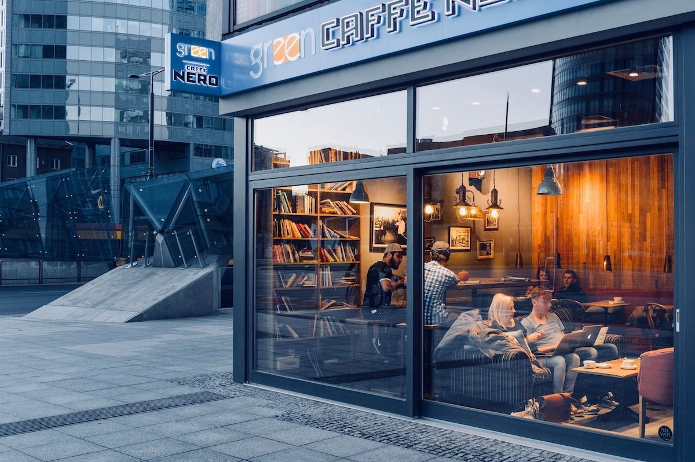

Welcome to my blog. I hope you will read blog posts and --- contribute yourself.

##FIKA

>"Functioning as both a verb and a noun, the concept of fika is simple. It is the moment that you take a break, often with a cup of coffee, but alternatively with tea, and find a baked good to pair with it. You can do it alone, you can do it with friends. You can do it at home, in a park or at work. But the essential thing is that you do it, that you make time to take a break: that's what fika is all about."  

>(source: Fika: [The Art of the Swedish Coffee Break] (https://www.thekitchn.com/what-in-the-world-is-fika-an-intro-to-the-swedish-coffee-break-the-art-of-fika-219297))

###-- Clara & La Helen

_Photo creds: 
Jacek Dylag
@dylu_

