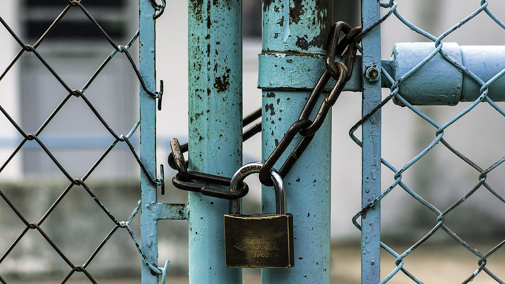

Customers used to pay with money. But nowadays many app or web services are seemingly for free. But they are not really free. No, such services customers are not paying with money they pay with data. 

Data has become a currency. Thus the big question remains: who owns the data. Is it the customer's data or is it the companies data, since customers paid with their data? 

Independent of an answer to this very question, one thing is for sure: data and especially personal data need to be protected.

In order to ensure this, the issue of data security becomes a central topic. Data security needs to be an inbuilt feature into any digital offer or service.

Here are the areas which data security needs to deal with:

1. Security of transfer: PGP, HTTPS, TSL / SSL, etc.
1. Security of access: Authentification.
1. Security of databases: Encryption, division of concerns.
1. Security of transactions: PIN / TAN etc.
1. Security of passwords: Finger prints, face recognition.
1. Security of systems: Protection from viruses, ransomware, espionage.
1. Security for company clouds: Data may be accessible by cloud provider.
1. Security of encryption: Choose the right procedure. Not all encryptions are safe.

